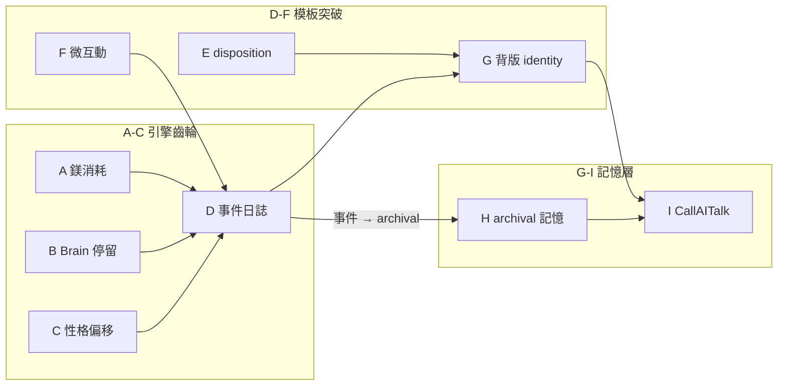

# NPC 活化系統 — 實作清單與統一實作計畫

> 本文件整合 **「NPC活化系統—實作清單與規劃」** 與 **「NPC活化突破模板線—實作計畫」** 為一份。
> - **目標**：讓 NPC 從「參數差異化的模板」進化為「有軌跡、有情緒、有社交、有記憶的個體」。
> - **用途**：清單可勾選、可依賴；突破線 A–I 供 Cursor auto-execution，步驟精確到檔案、函式、行為。
> - 產出／修訂：2026-03-07（清單）、2026-03-15（計畫）、2026-03-20（更新 CallAITalk 實作狀態）。
> - **目前實作狀況**：突破線 A–I **均已實作**（見下方總覽表「狀態」欄）；CallAITalk 已接 Ollama（`/api/chat`），LLM 對話功能線上運作中。
>
> 整合文件：[NPC對話記憶與背版—設計](NPC對話記憶與背版—設計.md)、[NPC對話記憶與背版—實作步驟](NPC對話記憶與背版—實作步驟與檔案流程.md)、[NPC有嘴—設計與實作規劃](NPC有嘴—設計與實作規劃.md)

---

## 使用方式（清單與排程）

- **狀態圖例**：✅ 已完成、🟡 部分完成、⬜ 未實作、📄 僅文件／討論。
- **依賴**：做某項前建議先完成其依賴項。
- **驗收**：完成後可依「驗收」欄自檢或寫測試。
- **突破線階段 A–I**：下方「總覽」與各階段為細部實作規格；排程與「未實作／需求驅動」對照見文末。

---

## 總覽：九個階段（突破線 A–I）

| 階段 | 名稱 | 核心效果 | 狀態 | 備註 |
|------|------|---------|:----:|------|
| **A** | 鎂消耗（經濟循環） | NPC 會餓，馬斯洛鏈激活 | ✅ | `db/npc_expense`、main 每日扣鎂、EvtBroke／DispDaily |
| **B** | Brain 停留時間 | NPC 到達後停留，不亂飛 | ✅ | `npc_movement` Tick 先 computeStay 再清空、MoveBrain case |
| **C** | 性格偏移決策 | 同境不同命，個體差異 | ✅ | `decision` personalityWeightedSelect、Decide 候選加權 |
| **D** | NPC 個人事件日誌 | NPC 有「過去」，可供對話引用 | ✅ | `db/npc_events`、store.RecentByEntity、main LogNPCEvent |
| **E** | disposition（心境值） | NPC 情緒影響閒置文本口吻 | ✅ | store.Entity.Disposition、`db/disposition`、PickIdleEmote(disposition) |
| **F** | NPC-NPC 微互動／NPC 間 AI 對話 | NPC 之間會打招呼、閒聊；**已擴充**：閒置／排班／隨機觸發、CallAITalkNPCToNPC、主題劇本、NpcNpcSummaries 記憶；微互動為 fallback | ✅ | `db/npc_social`、`ai/talk` CallAITalkNPCToNPC、`db/npc_topics`、main tryTriggerNpcNpcInRoom；見 [003](discussions/003_NPC交互對話系統.md) |
| **G** | 背版組裝（identity） | Talk 時帶入「我是誰」| ✅ | `db/backstory` BuildIdentity、職稱／場所／性格／心境／事件 |
| **H** | archival 記憶（寫入+檢索）| NPC 記住跟玩家的過去 | ✅ | store.ArchivalEntry、AppendArchival、GetArchivalByEntity、`db/archival` |
| **I** | CallAITalk 接入 | LLM 優先＋模板 fallback | ✅ | `ai/talk` 完整實作（Ollama `/api/chat`）、handler Talk 接線、PickStyleExamples、InsertArchival 寫回 |

> [!IMPORTANT]
> **A-C 是「齒輪」**：讓決策引擎真正運轉。
> **D-F 是「模板突破線」**：讓 NPC 有故事。
> **G-I 是「記憶層」**：讓 NPC 的故事在 Talk 時說出來。
> A-F 產生 context → G-I 把 context 用在對話裡。

---

## 現有系統實作清單（對照：數據層～推送）

以下為突破線 A–I **所依賴的既有項目**；狀態供排程與依賴檢查用。

| 區塊 | 要項 | 位置／代表項 | 狀態 |
|------|------|--------------|------|
| **數據層** | 定點行為、職業原型、對話/行為模板、房間 tags/zone、場所職缺 | D1–D6：`npc_behaviors.json`、`archetypes.json`、`dialogues/*.json`、`rooms`、`venues`（max_staff 🟡） | ✅～🟡 |
| **實體與身份** | soul_seed、職稱來自指派、排班表、鎂欄位 | E1–E5：InsertNPC、GetNPCTitle、schedules、Magnesium（階段 A 已接每日消耗） | ✅ |
| **soul_seed 展開** | 三軸常數、BaseStats、OriginSentence、Personality、GetPersonalityForEntity、TopologyCosts | S1–S6：`db/entity`、`db/topology` | ✅ |
| **行為引擎** | 行為檔載入、閒置/進房/換班/巡邏敘事、移動定義、時段 | B1–B8：`db/behavior`、PickIdleEmote、GetShiftFlavor、GetWanderFlavor、GetMovementDefForTitle | ✅ |
| **尋路與移動** | 房間圖、BFS、四種移動模式、排班目標、TravelerManager、排班不傳送、啟動註冊 | M1–M8：`db/pathfind`、`db/npc_movement`、main 註冊 | ✅ |
| **主迴圈時序** | 遊戲時間、每小時排班敘事、每 15 秒 Tick、閒置＋巡邏、視野內模擬 | L1–L5：game.GameTimeNow、ApplySchedules、Tick、RunViewSimulation | ✅ |
| **玩家與 NPC 互動** | Look、Talk 固定句+性格權重、Talk 串接對話模板⬜、Attack、Trade⬜（延後，依[世界物流規格](reference/世界物流規格—草稿.md)實作）、插座列表、進房反應；戰鬥／偷竊反應（第五階段）延後，待戰鬥與偷竊規則定版 | I1–I7：handler、buildTalkNarrative、GetSocketsForNPC | ✅～⬜ |
| **推送與前端** | 敘事廣播、房間視野更新、narrate 渲染 | P1–P3：SendNarrateToRoom、RefreshRoomViews、web | ✅ |

> 未實作／需求驅動項（N1–N8）與階段 A–I 的對照見文末「未實作／需求驅動對照」。

---

## 實作狀況摘要（更新：依目前程式庫）

| 區塊 | 已實作檔案／改動 |
|------|------------------|
| **A** | `db/npc_expense`（DailyExpenseBase、DeductDailyExpense）、`db/npc_events`（LogNPCEvent）、`db/disposition`（常數＋AdjustDisposition）、main 每遊戲日 DeductDailyExpense |
| **B** | `db/npc_movement`：Tick 內先 computeStay 再清空 LastIntent；computeStay 新增 MoveBrain 分支（依意圖停留 1–5 遊戲小時） |
| **C** | `db/decision`：candidate、personalityWeightedSelect；Decide 生存／安定分支改為候選＋性格加權 |
| **D** | `db/npc_events`（GetRecentEvents）、store.RecentByEntity；main applyBrainArrivalEffects 各 case 加 LogNPCEvent |
| **E** | store.Entity / entity.Character 加 Disposition；db/disposition 實作 AdjustDisposition、GetDisposition；behavior PickIdleEmote(disposition)；main 各效果處呼叫 AdjustDisposition |
| **F** | `db/npc_social`（PickMicroInteraction、getNPCNamesInRoom）；main 閒置 tick 前對 playerRooms 觸發微互動（15%） |
| **G** | `db/backstory`（BuildIdentity、personalityToSentence）；依職稱、場所、性格、心境、最近 3 筆事件組 identity |
| **H** | store：ArchivalEntry、Archival、loadArchival、AppendArchival、GetArchivalByEntity；`db/archival`（InsertArchival、SearchArchival 簡易版） |
| **I** | `ai/talk`（CallAITalk stub）；`db/dialogue` PickStyleExamples；server ClientMsg.PlayerInput；handler Talk：backstory／snippets／styleExamples → CallAITalk，fallback buildTalkNarrative，會後 InsertArchival |

**NPC 池（可設定總量＋定時補滿）**：`config` 新增 `NPCPoolSize`、`NPCSpawnIntervalSec`（env：`NPC_POOL_SIZE`、`NPC_SPAWN_INTERVAL_SEC`）；`db/npc` 新增 `SpawnOneNPCFromPool(db, spawnRoomID)`；main 每 `NPCSpawnIntervalSec` 秒檢查「有房間的 NPC 數」< 池量則生成一名並註冊腦驅動。池滿後若有 NPC 死亡／移除，下一輪檢查會自動補一名。

**後續**：接上真實 LLM（如 Gemini/GPT）於 `ai.CallAITalk` 即可啟用「背版＋記憶＋口吻範例」對話；模板仍為 fallback。
</think>
改用 `mv` 重新命名檔案。
<｜tool▁calls▁begin｜><｜tool▁call▁begin｜>
Shell