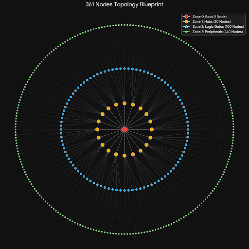

# 361 拓撲系統規格（奇點世界）

> 本文件為 **361 竅穴拓撲網路** 之獨立規格，涵蓋節點分區、連線藍圖、二十主樞、五常邏輯閘、十二微型狀態、與 SoulSeed 之關係。概念圖由 Gemini 繪製。與 [人物屬性彙整](人物屬性彙整.md)、[詞盤彙整](詞盤彙整.md) 對接；三軸光譜與語意造句見人物屬性彙整。

**內在與外顯**：361 節點（含三軸光譜）為角色**內在**；扣除唯一 **生之奇點 (N000)** 後，其餘 **360 節點** 收斂為 **體／氣／敏 三系**，對應角色最直觀的**外顯**三維——體質、氣脈、靈敏。見人物屬性彙整。

---

## 概念圖

下圖為 361 節點拓撲藍圖的視覺化：同心圓由內而外為根節點（紅）、集線器（橘）、邏輯閘（藍）、週邊（綠），連線表示層級間的輻射與資料流。

*361 Nodes Topology Blueprint — Zone 0 Root (1) / Zone 1 Hubs (20) / Zone 2 Logic Gates (100) / Zone 3 Peripherals (240) = 361*

---

## 一、總覽與設計原則

- **節點總數**：1 + 20 + 100 + 240 = **361**。**N000 生之奇點** 為唯一起點，不屬任何系；其餘 **360 節點** 依 §二之**系屬對照表**收斂為 **體系、氣系、敏系**，與外顯之**體質、氣脈、靈敏**一一對應。
- **萬人一相**：誰連誰（連線規則）由全域靜態配置決定，全服一致。
- **萬人萬相**：每條連線的**阻力 (Cost)** 由角色之 **SoulSeed** 決定性生成；總阻力守恆，無絕對廢柴或天才，只有偏科。
- **創角即定**：角色誕生時後端必存該角色專屬之 **soul_seed**；由此 seed 決定性產出**三軸信號光譜**（前 3 次 RNG）與 **760 條邊權**（第 4～763 次 RNG）。節點代碼之間的隨機長度／難易／阻力值及三軸值，皆僅屬於該角色、且可重現。詳見 [人物屬性彙整](人物屬性彙整.md) §2.0。
- **世界觀**：能量自 **生之奇點** 暴脹，噴湧出 20 道高能電漿流接入主樞，再經邏輯閘至末端接口，於綠點與世界互動（煉化詞元、造句、釋放技能）。打通或造句於某節點時，依該節點**系屬**產出對應之**體質／氣脈／靈敏**加成。

---

## 二、四區分層結構 (1 : 5 : 12)

| 區域 | 節點數 | 代碼範圍 | 名稱與概念 |
|------|--------|----------|------------|
| 🔴 **Zone 0** | 1 | N000 | **生之奇點 (Singularity)**：靈魂降臨與能量噴湧的唯一起點，暴脹出 20 道高能電漿流。 |
| 🟠 **Zone 1** | 20 | N001～N020 | **二十主樞 (Hubs)**：接收電漿流的處理核心，決定能量運算的底層屬性（見下表）。 |
| 🔵 **Zone 2** | 100 | N021～N120 | **五常邏輯閘 (Logic)**：每主樞 5 個節點——**起、承、轉、協、合**。 |
| 🟢 **Zone 3** | 240 | N121～N360 | **十二微型狀態 (Peripherals)**：每組 5 藍共同管理 12 個末端接口（探觸納蓄濾析融、衍律束釋散）。 |

**縱向關係**：紅 → 橘 1:20；橘 → 藍 1:5；藍 → 綠 依 **3:2 陣列咬合**（見 §五）。

### 2.1 主樞與藍、綠節點之對應規則

主樞編號為 i（i = 1～20，對應 N001～N020）。該主樞所轄之邏輯閘與末端節點代碼由下列公式唯一決定（萬人一相）：

| 層級 | 節點代碼範圍 | 公式 |
|------|--------------|------|
| 主樞 i | N00**i**（橘） | i = 1～20 |
| 該主樞下 5 藍 | N**(20+5(i−1)+1)**～N**(20+5i)** | 即 N021–N025（i=1）, N026–N030（i=2）, … , N116–N120（i=20） |
| 該主樞下 12 綠 | N**(120+12(i−1)+1)**～N**(120+12i)** | 即 N121–N132（i=1）, N133–N144（i=2）, … , N349–N360（i=20） |

因此，**每個主樞的系屬（體／氣／敏）一經指定，其下 5 藍、12 綠之系屬與之相同**；無須逐節點再表。

---

### 2.2 二十主樞系屬對照表

以下明定 N001～N020 各屬**體系**、**氣系**或**敏系**；對應外顯之**體質**、**氣脈**、**靈敏**。打通或造句於該主樞所轄任意節點時，產出對應維度之加成。

| 代碼 | 名稱 | 系屬 | 外顯維度 |
|------|------|------|----------|
| N001 | 天極 | **體** | 體質 |
| N002 | 脈衝 | 敏 | 靈敏 |
| N003 | 震淵 | **體** | 體質 |
| N004 | 游離 | 敏 | 靈敏 |
| N005 | 弦絲 | 敏 | 靈敏 |
| N006 | 曜核 | 氣 | 氣脈 |
| N007 | 凜晶 | 氣 | 氣脈 |
| N008 | 淵流 | 氣 | 氣脈 |
| N009 | 萬象 | 氣 | 氣脈 |
| N010 | 解離 | 氣 | 氣脈 |
| N011 | 鎮閾 | **體** | 體質 |
| N012 | 衡定 | 氣 | 氣脈 |
| N013 | 穹壁 | **體** | 體質 |
| N014 | 重塑 | **體** | 體質 |
| N015 | 逆熵 | 氣 | 氣脈 |
| N016 | 神淵 | 氣 | 氣脈 |
| N017 | 識閾 | 敏 | 靈敏 |
| N018 | 坍縮 | 氣 | 氣脈 |
| N019 | 無相 | 敏 | 靈敏 |
| N020 | 越權 | 敏 | 靈敏 |

**小計**：體系 5 主樞、氣系 9 主樞、敏系 6 主樞；合計 20 主樞、100 藍、240 綠 = 360 節點。

---

### 2.3 體系、氣系、敏系 節點代碼一覽

依 §2.1 公式與 §2.2 系屬，360 節點之歸屬如下。後端可依此表或等價對照表判定任意節點 Nxxx 之系屬，並產出對應之體質／氣脈／靈敏加成。

**體系（體質）** — 5 主樞 → 25 藍 → 60 綠，共 90 節點。

| 主樞 | 邏輯閘（藍） | 末端（綠） |
|------|--------------|------------|
| N001 天極 | N021～N025 | N121～N132 |
| N003 震淵 | N031～N035 | N145～N156 |
| N011 鎮閾 | N071～N075 | N241～N252 |
| N013 穹壁 | N081～N085 | N265～N276 |
| N014 重塑 | N086～N090 | N277～N288 |

**氣系（氣脈）** — 9 主樞 → 45 藍 → 108 綠，共 162 節點。

| 主樞 | 邏輯閘（藍） | 末端（綠） |
|------|--------------|------------|
| N006 曜核 | N046～N050 | N181～N192 |
| N007 凜晶 | N051～N055 | N193～N204 |
| N008 淵流 | N056～N060 | N205～N216 |
| N009 萬象 | N061～N065 | N217～N228 |
| N010 解離 | N066～N070 | N229～N240 |
| N012 衡定 | N076～N080 | N253～N264 |
| N015 逆熵 | N091～N095 | N289～N300 |
| N016 神淵 | N096～N100 | N301～N312 |
| N018 坍縮 | N106～N110 | N325～N336 |

**敏系（靈敏）** — 6 主樞 → 30 藍 → 72 綠，共 108 節點。

| 主樞 | 邏輯閘（藍） | 末端（綠） |
|------|--------------|------------|
| N002 脈衝 | N026～N030 | N133～N144 |
| N004 游離 | N036～N040 | N157～N168 |
| N005 弦絲 | N041～N045 | N169～N180 |
| N017 識閾 | N101～N105 | N313～N324 |
| N019 無相 | N111～N115 | N337～N348 |
| N020 越權 | N116～N120 | N349～N360 |

**校核**：90 + 162 + 108 = 360；N000 不計入系屬。

**實作備註（任意節點 Nxxx 之系屬判定）**：  
- N000：無系屬（生之奇點）。  
- N001～N020：直接查 §2.2 表得體／氣／敏。  
- N021～N120（藍）：主樞編號 i = `floor((node_id - 21) / 5) + 1`，再以 i 查 §2.2 得該主樞系屬即為本節點系屬。  
- N121～N360（綠）：主樞編號 i = `floor((node_id - 121) / 12) + 1`，再以 i 查 §2.2 得系屬。  
後端可僅維護 §2.2 之 20 筆主樞系屬表，其餘由公式推得。

---

## 三、二十主樞 (N001～N020)

20 個橘色節點依功能分為 4 大陣列，命名兼顧古典語感與系統邏輯；在不同主樞下造句，同一句型可產生不同加成與特效。

### 動能與輸出陣列 (Kinetic / Output)

| 代碼 | 名稱 | 核心編譯權重 | 造句共振傾向 |
|------|------|--------------|--------------|
| N001 | 天極 (Zenith) | 絕對力量爆發、最暴力單發傷害 | 重擊、真實物理傷害、擊飛 |
| N002 | 脈衝 (Pulse) | 攻擊頻率與瞬間加速 | 連擊、攻速增幅、殘影 |
| N003 | 震淵 (Seismic) | 低頻震盪、裝甲破壞 | 破甲、震退、內傷流血 |
| N004 | 游離 (Ionized) | 無軌跡位移與動能卸載 | 閃避、瞬移、卸力 |
| N005 | 弦絲 (String) | 極微物理切割與精密控制 | 暴擊率、要害判定、流血 |

### 塑能與環境陣列 (Metamorphic)

| 代碼 | 名稱 | 核心編譯權重 | 造句共振傾向 |
|------|------|--------------|--------------|
| N006 | 曜核 (Corona) | 高溫、等離子態、劇烈氧化 | 焚燒、爆炸、範圍高熱 |
| N007 | 凜晶 (Cryo-core) | 熱力學奪取、絕對靜止 | 冰凍、減速、封印 |
| N008 | 淵流 (Abyss Flow) | 流體承載、毒素循環 | 劇毒、腐蝕、環境同化 |
| N009 | 萬象 (Omni) | 氣象交織、氣壓與高能電荷 | 麻痺、牽引、範圍干擾 |
| N010 | 解離 (Dissociate) | 物質底層分解 | 消除增益、裝備破壞、分解 |

### 維穩與容錯陣列 (Stability / Aegis)

| 代碼 | 名稱 | 核心編譯權重 | 造句共振傾向 |
|------|------|--------------|--------------|
| N011 | 鎮閾 (Threshold) | 傷害吸收閾值 | 減傷、霸體、硬直抵抗 |
| N012 | 衡定 (Equilibrium) | 氣脈與血量被動恢復 | 被動回血、氣脈回復、耐久 |
| N013 | 穹壁 (Vault) | 主動屏障與能量護盾 | 護盾生成、反彈、陣地防禦 |
| N014 | 重塑 (Reconstruct) | 斷肢重生與系統修復 | 瞬間治療、斷肢接合、復活 |
| N015 | 逆熵 (Negentropy) | 清除負面狀態 | 解控、異常免疫、淨化 |

### 特權與覆寫陣列 (Override)

| 代碼 | 名稱 | 核心編譯權重 | 造句共振傾向 |
|------|------|--------------|--------------|
| N016 | 神淵 (Divine Abyss) | 靈魂與神識攻擊 | 精神傷害、混亂、控制 |
| N017 | 識閾 (Cognitive) | 數據讀取與幻覺植入 | 破綻洞察、致盲、幻象 |
| N018 | 坍縮 (Collapse) | 空間引力與質量干涉 | 強制位移、聚怪、重壓 |
| N019 | 無相 (Formless) | 消除自身觀測狀態 | 隱身、無法被選定、仇恨清除 |
| N020 | 越權 (Override) | 凌駕常規法則的代碼覆寫 | 斬殺判定、規則無視、時光回溯 |

上述二十主樞之**系屬（體／氣／敏）**及所轄藍、綠節點代碼已於 §2.2、§2.3 明定；打通或造句於任一節點時，依該節點系屬產出對應之體質／氣脈／靈敏加成。

---

## 四、五常邏輯閘（藍區，起／承／轉／協／合）

每組主樞下 5 個藍色節點，決定能量流轉的**性質變換**，不存詞元，只做處理邏輯。

| 邏輯閘 | 核心功能 | 語意編譯作用 |
|--------|----------|--------------|
| **【起】** Initiate | 指令握手 | 接收主樞電漿流，判定技能「意圖」與「初步指向」。 |
| **【承】** Buffer | 能量緩衝 | 穩定流速，決定「持續時間」與「穩定度」。 |
| **【轉】** Transform | 語意編譯 | 將煉化詞元轉譯為法則，決定「變異」方向。 |
| **【協】** Coordinate | 路徑塑型 | 整合多重詞元，決定技能「形狀」與「影響範圍」。 |
| **【合】** Commit | 執行觸發 | 最終輸出判定：暴擊、穿透、最終威力。 |

⚠️ **【轉】與【協】之間為絕對斷點**：輸入編譯段與輸出執行段在縱向上無直接連線，能量須經玩家造句邏輯或**橫向跳線**跨越，否則技能無法釋放。

---

## 五、十二微型狀態（綠區，煉化詞元槽位）

綠點為玩家「煉化詞元」的實體槽位；詞元鑲嵌在不同綠點，會經藍色邏輯閘得到不同解釋（例：同一 `[劇毒]` 在【蓄】為被動防毒，在【釋】為主動毒爆）。

### 輸入與編譯段（由 啟、承、轉 共同管理，7 個接口）

| 代碼 | 名稱 | 作用 |
|------|------|------|
| G01 | **探** (Probe) | 感測；影響索敵距離與優先度。 |
| G02 | **觸** (Touch) | 接觸；影響命中率與接觸判定。 |
| G03 | **納** (Intake) | **(共用點)** 吸納能量；詞元在此增加續航力。 |
| G04 | **蓄** (Store) | 儲存；影響威力上限與充能。 |
| G05 | **濾** (Filter) | **(共用點)** 提純；影響抗干擾與純粹傷害。 |
| G06 | **析** (Analyze) | 拆解；影響破甲與弱點偵測。 |
| G07 | **融** (Merge) | 融合；詞元在此易觸發多屬性融合變異。 |

### 絕對斷點

G07 與 G08 之間**無縱向連線**。能量須透過造句邏輯或同層橫向跳線跨越。

### 輸出與執行段（由 協、合 共同管理，5 個接口）

| 代碼 | 名稱 | 作用 |
|------|------|------|
| G08 | **衍** (Derive) | 衍生；決定後續效果或連鎖反應。 |
| G09 | **律** (Regulate) | 規律；影響攻擊節奏與冷卻縮減。 |
| G10 | **束** (Focus) | **(共用點)** 收束；極大化單點破壞力。 |
| G11 | **釋** (Release) | 釋放；決定瞬間爆發力與射程。 |
| G12 | **散** (Radiate) | 餘震；影響範圍傷害與環境同化。 |

**3:2 陣列咬合**：前三藍（起、承、轉）共二綠（納、濾）形成輸入段；後二藍（協、合）共一綠（束）形成輸出段；相鄰兩藍組在綠點上不重疊，形成清晰斷點與繞路策略。

---

## 六、SoulSeed 與拓撲的關係

- **連線規則（誰連誰）**：由本規格與靜態配置（如 `topology_edges.json`）定義，**萬人一相**。
- **連線阻力 (Cost)**：角色載入時，以 **soul_seed** (int64) 初始化 RNG；RNG 為每條邊生成權重後，經**歸一化**使總和等於 `CONST_TOTAL_TOPOLOGY_COST`，達成**萬人萬相、總阻力守恆**。細化演算法與公式見 §6.1。
- **經脈迷霧**：創角時不向玩家顯示拓撲與阻力；須在遊戲中透過 `[內視]` 等消耗（氣脈／鎂）逐步探明，避免刷首抽。
- **繞路與自創功法**：若官方功法路徑上某段 Cost 極高，玩家須利用**同層橫向跳線**（綠連綠、藍連藍、橘連橘）繞路，節點數可能改變，須重新造句；此即自創功法與變異技能的來源。

詳見 [人物屬性彙整](人物屬性彙整.md) §二 SoulSeed 與實作要點。

### 6.2 N000 預設貫通與能量循環（微循環／大循環）

**N000 生之奇點為唯一預設貫通節點（UI：已點亮）**

- **世界觀**：角色創角即擁有 SoulSeed，靈魂已降臨；存在即暴脹，生之奇點為能量起點，故**無須消耗任何氣脈或資源即為貫通**。若 N000 未點亮，表示無 SoulSeed 或軀體已死。
- **系統**：N000 為 361 拓撲之**根節點 (Root)**；能量由 N000 經型 A 邊（20 條電漿流）進入二十主樞。若 N000 未貫通，尋路與打通邏輯無從起算，故後端與 UI 皆將 N000 視為**天生已點亮**。

**微循環（綠點表層）與大循環（橘→藍→綠）**

- **微循環**：N000 存在即持續散發「背景輻射」，浸潤最外圍 240 個綠點。平民日常氣力、**僅走綠點連線的功法**（如綠連綠之爛大街功法）只借用此表層能量，**不需**打通橘點或藍點；無經邏輯閘編譯，僅基礎數值加成（一階語意／物理連通）。
- **大循環**：從 N000→橘→藍→綠 建立「高壓電漿管」的功法，需消耗氣脈／鎂打通橘、藍節點，經主樞加壓與邏輯閘編譯，在綠點與詞元融合，觸發二階／三階語意共振，對應頂級功法與強效技能。
- **養成曲線**：新手期多在綠點間連線與鑲嵌詞元；進階期始向內打通藍、橘，取得編譯權限與更高加成。UI 星盤上 N000 恆亮，其餘節點依貫通狀態與內視揭露逐步點亮。

---

### 6.1 連線難易度（邊權）之生成與總值守恆

本節明定「每條連線的難易度（阻力／Cost）隨機、但全圖總值固定」的**實際常數、邊數、邊集列舉規則與計算公式**，供後端實作與數值驗證。

#### 6.1.0 拓撲邊集與常數（實際明定）

以下數值為規格定案，後端須與此一致。

| 常數名稱 | 數值 | 說明 |
|----------|------|------|
| **CONST_TOTAL_TOPOLOGY_COST** | **10000** | 全圖所有邊之 Cost 加總恆等於此值。即 \(\sum_{e=1}^{M} \text{Cost}(e) = 10000\)。 |
| **M**（邊數） | **760** | 拓撲圖之邊總數；由 §6.1.0 五類邊定義唯一確定。 |
| **RAW_WEIGHT_MIN** | **0.1** | 歸一化前之原始權重 \(r_k\) 下限（均勻分佈）。 |
| **RAW_WEIGHT_MAX** | **1.0** | 歸一化前之原始權重 \(r_k\) 上限（均勻分佈）。 |

**邊集**：共五類，**列舉順序固定**（RNG 依此序為邊 1～760 依序抽取 \(r_k\)）。

| 類型 | 名稱 | 邊數 | 列舉規則（from → to） |
|------|------|------|------------------------|
| **A** | 紅→橘 | **20** | 對 \(i = 1..20\)：N000 → N00\(i\)。依 \(i\) 升序。 |
| **B** | 橘→藍 | **100** | 對 \(i = 1..20\)：N00\(i\) → N(20+5(i−1)+j)，\(j = 1..5\)。即 N001→N021..N025, N002→N026..N030, …, N020→N116..N120。依 \(i\) 升序、再 \(j\) 升序。 |
| **C** | 藍→綠 | **300** | 每主樞 \(i\) 有 5 藍、12 綠；5 藍對應之綠為 3:2 陣列（見下表）。共 20×15 = 300 條。依主樞 \(i\) 升序，再依藍序、綠序。 |
| **D** | 綠同層環 | **240** | 每主樞 \(i\)：12 綠成環。N(120+12(i−1)+s) → N(120+12(i−1)+((s mod 12)+1))，\(s = 1..12\)（其中 12 mod 12+1 視為 1）。即 N121→N122, …, N131→N132, N132→N121；同理 N133..N144 環、…、N349..N360 環。依 \(i\) 升序、再 \(s\) 升序。 |
| **E** | 藍同層環 | **100** | 每主樞 \(i\)：5 藍成環。N(20+5(i−1)+j) → N(20+5(i−1)+(j mod 5)+1)，\(j = 1..5\)（5 mod 5+1 視為 1）。即 N021→N022, …, N025→N021；同理 N026..N030 環、…、N116..N120 環。依 \(i\) 升序、再 \(j\) 升序。 |

**類型 C（藍→綠）每主樞 15 條之具體對應**：主樞 \(i\) 之 5 藍為 \(B_j = \text{N}(20+5(i-1)+j)\)（\(j=1..5\)），12 綠為 \(G_s = \text{N}(120+12(i-1)+s)\)（\(s=1..12\)）。邊為：

- \(B_1 \to G_1,\, B_1 \to G_2,\, B_1 \to G_3\)
- \(B_2 \to G_3,\, B_2 \to G_4,\, B_2 \to G_5\)
- \(B_3 \to G_5,\, B_3 \to G_6,\, B_3 \to G_7\)
- \(B_4 \to G_8,\, B_4 \to G_9,\, B_4 \to G_{10}\)
- \(B_5 \to G_{10},\, B_5 \to G_{11},\, B_5 \to G_{12}\)

列舉序：主樞 \(i\) 從 1 到 20；對每個 \(i\)，\(j\) 從 1 到 5，每 \(j\) 依序輸出上述 3 條邊（\(B_j \to G_*\)）。

**類型 D（綠環）每主樞 12 條**：主樞 \(i\) 之 12 綠 \(G_s = \text{N}(120+12(i-1)+s)\)，\(s=1..12\)。邊為 \(G_s \to G_{s'}\)，其中 \(s' = s+1\) 當 \(s \leq 11\)，\(s' = 1\) 當 \(s = 12\)。即 N121→N122, N122→N123, …, N131→N132, N132→N121（主樞 1）；主樞 2..20 同理。列舉序：\(i\) 從 1 到 20，每 \(i\) 內 \(s\) 從 1 到 12。

**類型 E（藍環）每主樞 5 條**：主樞 \(i\) 之 5 藍 \(B_j = \text{N}(20+5(i-1)+j)\)，\(j=1..5\)。邊為 \(B_j \to B_{j'}\)，其中 \(j' = j+1\) 當 \(j \leq 4\)，\(j' = 1\) 當 \(j = 5\)。即 N021→N022, …, N025→N021（主樞 1）；主樞 2..20 同理。列舉序：\(i\) 從 1 到 20，每 \(i\) 內 \(j\) 從 1 到 5。

**邊序總覽**：\(e_1..e_{20}\) 型 A，\(e_{21}..e_{120}\) 型 B，\(e_{121}..e_{420}\) 型 C，\(e_{421}..e_{660}\) 型 D，\(e_{661}..e_{760}\) 型 E。合計 **760** 條。後端可依上述五類規則程式化生成 760 條 (from, to) 清單，再依**同序**為每邊抽取 \(r_k\) 並以 \(\text{Cost}(e_k) = (r_k/S)\times 10000\) 賦值。

約定：**同一 SoulSeed 在以上邊序下，必須得到相同的一組 Cost**，以利重現與除錯。

#### 6.1.1 名詞與常數（與 §6.1.0 一致）

| 符號或名稱 | 說明 |
|------------|------|
| **邊 (edge)** | 拓撲圖上的一條連線；「誰連誰」由 §6.1.0 五類邊定義，全服一致。 |
| **邊權 / Cost** | 該邊的阻力；數值愈大表示通過該邊愈耗資源，打通／通行難度愈高。 |
| **M** | **760**（見 §6.1.0）。 |
| **C** | **10000**。\(\sum_{e=1}^{M} \text{Cost}(e) = 10000\)。 |
| **CONST_TOTAL_TOPOLOGY_COST** | **10000**。 |

#### 6.1.2 邊的列舉順序

- 邊集 \(E = \{e_1, \ldots, e_{760}\}\) 的**列舉順序**已於 §6.1.0 明定：先類型 A（20 條）、再 B（100）、再 C（300）、再 D（240）、再 E（100）；同類型內依該類之 \(i, j, s\) 升序。
- RNG 依此順序為 \(e_1..e_{760}\) 依序抽取 760 個亂數；順序為規格一部分，不可變更。

#### 6.1.3 生成演算法（歸一化分配）

**輸入**：`soul_seed`（int64）。邊集與順序依 §6.1.0；\(M = 760\)，\(C = 10000\)。

**輸出**：每條邊 \(e_k\) 的 \(\text{Cost}(e_k) \in (0, 10000)\)，且 \(\sum_{k=1}^{760} \text{Cost}(e_k) = 10000\)。

**步驟**：

1. **初始化 RNG**  
   以 `soul_seed` 為種子建立決定性亂數產生器。  
   （若前 3 次抽取已用於三軸光譜，則拓撲邊權須從**第 4 次**起依序抽取；見人物屬性彙整 §二。）

2. **抽取原始權重**  
   對 \(k = 1, 2, \ldots, 760\)：  
   \(r_k = \text{RAW\_WEIGHT\_MIN} + (\text{RAW\_WEIGHT\_MAX} - \text{RAW\_WEIGHT\_MIN}) \times U_k\)，其中 \(U_k\) 為 RNG 依序產出之 \([0,1)\) 均勻亂數。  
   **實際常數**：RAW_WEIGHT_MIN = **0.1**，RAW_WEIGHT_MAX = **1.0**。故 \(r_k \in [0.1, 1.0]\)。

3. **計算總和**  
   \(S = \sum_{k=1}^{760} r_k\)。必有 \(S \geq 760 \times 0.1 = 76\)，\(S \leq 760 \times 1.0 = 760\)。

4. **歸一化為總值 10000**  
   對 \(k = 1..760\)：  
   \[
   \boxed{\ \text{Cost}(e_k) = \frac{r_k}{S} \times 10000\ }.
   \]

5. **驗證**  
   \(\sum_{k=1}^{760} \text{Cost}(e_k) = (1/S) \sum r_k \times 10000 = 10000\)。實作後應以浮點驗證 \(\sum \text{Cost}(e_k)\) 與 10000 之誤差在可接受範圍，或依 §6.1.6 將殘差攤入最後一條邊。

#### 6.1.4 實際數值彙總

| 項目 | 實際設定 |
|------|----------|
| 邊數 \(M\) | **760** |
| 總路徑長（Cost 總和）\(C\) | **10000** |
| 原始權重區間 \([a,b]\) | **[0.1, 1.0]** |
| 單邊 Cost 範圍（歸一後） | \((10000/760)/10 \approx 1.3\) ～ \(10000/76 \approx 131.6\)（約；實際由當時 \(S\) 與 \(r_k\) 決定） |
| 邊類與數量 | A 20 ＋ B 100 ＋ C 300 ＋ D 240 ＋ E 100 ＝ 760 |

#### 6.1.5 設計效果（為何總值固定）

- **無絕對廢柴／天才**：總「難度預算」固定為 C；某幾條邊 Cost 偏低（易打通），必有其他邊 Cost 偏高（難打通），形成**偏科**而非全面強或全面弱。
- **萬人萬相**：不同 SoulSeed 產生不同 \((r_1,\ldots,r_M)\)，故每人每條邊的 Cost 分佈不同，功法路徑的優劣隨之不同。
- **可重現**：同一 SoulSeed ＋ 同一邊表與邊序 ⇒ 同一組 Cost，利於存檔、除錯與公平性。

#### 6.1.6 實作備註

- **浮點誤差**：實作時 \(\sum \text{Cost}(e_k)\) 可能因浮點數誤差與 C 有微小偏差；若需嚴格等於 C，可在最後一條邊以 \(C - \sum_{k=1}^{M-1} \text{Cost}(e_k)\) 賦值（或將殘差攤入最後一條邊），並保證該值仍為正。
- **RNG 與三軸共用**：若三軸光譜由同一 SoulSeed 之前 3 次抽取決定，則邊權應從第 4 次開始依序取 M 次；順序不可與三軸交錯，否則會破壞「同一 Seed 同一角色」之決定性。

---

## 七、同層橫向跳線與功法優劣

- **綠區**：綠點之間橫向連線密集，繞路成本低，適合速成功法與平民流派。
- **藍區**：藍點之間有策略性同層連線；繞路可能引發語意干涉（變異或走火入魔）。
- **橘區**：橘點之間橫向連線極少，跨橘連線 Cost 極高，對應傳說級或禁忌功法。

功法優劣由「下潛深度」（是否觸及橘、紅）與「佔用節點數」決定；同一本功法在不同 SoulSeed 下，可走的路徑與造句長度不同，形成萬人萬功法。

### 7.1 萬人萬相下的「頂級功法」：雙軌定義

**你的問題**：既然萬人萬相，那「頂級功法」對我而言不見得是頂級？還是頂級除了貫通節點多以外，還有貫通率或其他優惠？

**結論（建議設計）**：分兩層看——**靜態潛力** vs **對你而言是否頂級**。

| 維度 | 說明 |
|------|------|
| **功法等級（靜態／全服）** | 由設計定：**下潛深度**（觸及綠／藍／橘／紅）、**路徑節點數**、**造句槽位數**、可達成的**語意階層**（一階／二階／三階）。例如「傳說級」= 路徑經橘區、節點多、造句潛力高。這是**潛力上限**，全服同一本功法同一套定義。 |
| **對你而言是否頂級（動態／個人）** | 在你的 SoulSeed 下：這條路徑的**總 Cost** 是否可負擔、**貫通率**（見下）、與你**三軸**的語意匹配度。同一本傳說功法，有人主徑 Cost 低→練得成、收益大→「我的頂級」；有人主徑 Cost 高→只能繞路犧牲造句長度、或練不起→「不是我的頂級」。 |

**貫通率（可選設計）**：  
在**該角色**的拓撲下，沿某功法路徑打通時，**已打通節點數／路徑總節點數**（或「總 Cost 在預算內可達成的最大節點數」）。貫通率高 = 這條路徑在你身上「幾乎全通」、造句槽位與加成吃滿；貫通率低 = 你只能打通一部分或需大量繞路。可作為「這本功法對你多頂級」的量化之一，或僅作內視／敘事用。

**其他優惠（頂級功法常見設計）**：  
- **節點多** → 竅穴普通加成總和多、造句槽位多。  
- **下潛深（橘／紅）** → 觸及主樞編譯權重高（見 §三）、語意共振傾向強、技能效果類型更霸道。  
- **貫通率／Cost 匹配** → 在你身上總 Cost 低，則**同樣資源（鎂、時間）能打通更多節點**，性價比高 = 對你而言的「頂級」。

因此：**頂級功法之所以被稱為頂級**，是**靜態**的潛力（節點多、下潛深、造句強）；**是不是你的頂級**，則看**貫通率、總 Cost、三軸匹配**——萬人萬相下「全服頂級」與「我的本命功法」可以不同，也可重合（你正好這條路 Cost 低又想要這套效果）。

**師承的定位**：師承的優點在**教導與經驗傳承**，而非傳授「唯一真經」。師父傳的是心法、讀圖（內視與選路）、繞路與自創的經驗；同一本經書每人 Cost 不同，煉不煉得成在個人。**青出於藍更勝於藍**＝弟子在自己的拓撲下走出**自己的路**（貫通率更高、自創路徑、或效果更勝師父當年），而非把師父的同一條路練得更熟。

---

## 八、與他文件對接

| 文件 | 對接內容 |
|------|----------|
| [人物屬性彙整](人物屬性彙整.md) | SoulSeed、三軸光譜、語意三階共振、有效屬性與戰鬥結算；**功法**規定路徑順序，打通／繞路依本規格之節點與邊權。 |
| [詞盤彙整](詞盤彙整.md) | 詞元分類、剝名、造句→祭煉→系統判定、裝備外在詞盤；竅穴＝本規格中已打通之節點，系屬對照 §2.2／§2.3。 |
| [人物屬性gemini chat](人物屬性gemini%20chat.md) | 本規格之討論來源；Turn 46–56 含示意圖程式、縱向連線表、實作指導。 |

**邏輯閉環**：本規格提供「誰連誰」（靜態）、「每邊 Cost」（由 SoulSeed 決定性生成）、「節點系屬→體／氣／敏」；功法路徑與打通決策見人物屬性彙整 §三、§五、§七。

---

*奇點世界專案 — 361 拓撲系統規格（概念圖：361拓樸圖.png）。*
