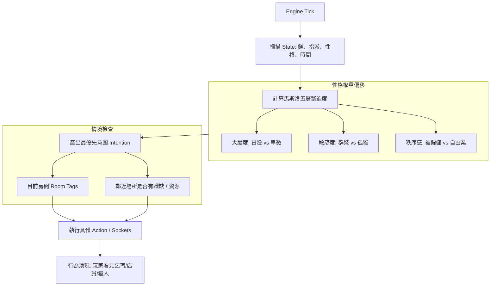

# 奇點決策引擎架構 (Decision Engine Architecture)

> 本文件定義《奇點世界》中 **NPC 決策引擎 (The Brain)** 的核心框架。
> 
> **定位**：這是一套將「內在需求（Maslow）」轉化為「具體行為（Actions/Sockets）」的邏輯中樞。它負責回答：**「NPC 現在為什麼要做這件事？」** 以及 **「在多個選擇中，他為什麼選這一個？」**

**對齊**：[奇點馬斯洛需求系統](奇點馬斯洛需求系統.md)、[狀態_指派_身份_核心概念](狀態_指派_身份_核心概念.md)、[討論 002 NPC 需求驅動與求職機制](../discussions/002_NPC需求驅動與求職機制.md)。行為映射之具體動作對應 [決策 002](../decisions/002_sockets_plugs_semantic.md) 插座語義（Beg、Trade、Gather、Attack 等）。

---

## 一、核心原理：從「狀態」到「湧現」

決策引擎不直接操作 NPC 的座標或對話，它只負責產出**「意圖 (Intention)」**。
運作路徑如下：
1. **感知 (Perception)**：掃描自身 `State` 與周遭 `Context`。
2. **需求權重 (Need Weighting)**：依據馬斯洛層級計算哪些需求未滿足。
3. **意圖選擇 (Intention Selection)**：依據 `SoulSeed` 性格偏移量，從候選意圖中選出最優解。
4. **行為映射 (Action Mapping)**：將意圖掛載至對應的插座行為（如執行 `Beg` 或 `ApplyJob`）。

> **鐵律：NPC 永遠不會「無事可做」。** 真實的人不會因為沒有 A 方案就躺死——再懶的人都知道乞食度日。引擎必須保證：無論環境多匱乏，NPC 總能產出至少一個意圖。當所有高優先級行為都不可行時，必須有兜底行為（如乞討、徘徊、發呆抱怨），而不是靜止不動。

---

## 二、三層結構設計

### 第一層：需求掃描器 (Needs Scanner) —— 「為什麼想動？」

引擎每隔固定 Tick 對 NPC 進行掃描，依照 **v8 版馬斯洛層級** 計算各層的「緊迫度」分數（0.0 ~ 1.0）：

| 層級 | 偵測指標 (State) | 緊迫度計算 (擬代碼) |
|------|------------------|---------------------|
| **1. 生存** | `Magnesium` | `clamp(1.0 - (current_mg / survival_line), 0, 1)` |
| **2. 安定** | `AssignmentID` | `has_assignment ? 0 : 0.8` (無職者有高度不安感) |
| **3. 社交** | `LastTalkAt` | `clamp((now - last_talk) / social_decay, 0, 1)` |
| **4. 尊重** | `EqValue` / `JobRank` | `ambition_score * (target_rank - current_rank)`（V2 實作時定義 ambition_score／target_rank；或簡化為存款／裝備未達標時緊迫度 > 0） |
| **5. 實現**（完整版） | soul_seed／長期目標旗標 | 依馬斯洛 v8 §二，實現層於 V3／完整版再接入；緊迫度由「離職探險意圖」或世界觀定義之旗標推導。 |

### 第二層：性格偏移處理 (Personality Offset) —— 「他會選哪條路？」

當多個層級的緊迫度同時觸發時（例如既沒錢也沒工作），NPC 的 **SoulSeed 三軸性格** 將決定選擇偏好：

- **大膽度 (Boldness)**：
    - 高：偏向高風險行為（自創行腳商前往荒野、參與狩獵、或向強者搭訕）。
    - 低：偏向下求行為（乞討、打零工、在安全區徘徊）。
- **敏感度 (Sensitivity)**：
    - 高：社交需求觸發極快；受負面狀態影響高；傾向於待在人煙稠密的社交點。
    - 低：能忍受長期孤獨與惡劣環境，行為更具目的性。
- **秩序感 (Orderliness)**：
    - 高：極度渴望 Assignment。比起自由捕獵，更傾向於去當舖、客棧找一份鐵飯碗。
    - 低：隨遇而安，偏向採集、拾荒等無約束的謀生方式。

### 第三層：世界情境匹配 (Context Matching) —— 「要在哪裡做？」

意圖必須結合**場所屬性 (Room Tags)** 才能落地為行為：

- **意圖：求生** + **場所：Gate/Social** $\Rightarrow$ 執行 `Beg` (乞討)。
- **意圖：求生** + **場所：Wilderness** $\Rightarrow$ 執行 `Gather` (拾荒)。
- **意圖：求生** + **場所：任何** $\Rightarrow$ 兜底：乞討、翻找、或移動尋找機會——NPC 不會因為場所不對就停止行動。
- **意圖：安定** + **場所：Venue(有空缺)** $\Rightarrow$ 執行求職流程（寫 assignment；若場所暴露 Hire 插座則對接，否則由後端求職撮合 tick 匹配）。
- **意圖：社交** + **場所：Tavern/Social** $\Rightarrow$ 執行 Idle 閒置敘事／閒置對話（對應現有「有嘴」設計之 Idle 文本）。

> **降級鏈（Fallback Chain）**：當意圖與場所不匹配時，NPC 不是放棄，而是降級到次優行為。例如：想求職但附近沒有空缺 → 降級為移動到有空缺的區域 → 途中經過社交場所順便閒聊 → 若移動途中鎂耗盡則就地乞討。行為是連續的，不存在「卡住」的狀態。

---

## 三、決策流程圖

---

## 四、實作階段建議

1. **V1：固定邏輯引擎 (Hardcoded Rules)**
    - 依據 `if-else` 固定優先序：`生存 > 安定 > 閒逛`；與 [奇點馬斯洛需求系統](奇點馬斯洛需求系統.md) §五 第一版對齊。
    - 性格僅用於隨機權重。

2. **V2：意圖評分系統 + 行為連貫性 (Scoring Engine + Continuity)** ← 目前代碼在此階段
    - 為每個行為（Beg, Trade, Work）撰寫 `Evaluate()` 函式。
    - 依據 `(NeedWeight * PersonalityFactor) + ContextBonus` 算出分值。
    - 選取最高分者執行。
    - ✅ **意圖慣性**——`decide_with_inertia()` 讓正在執行的意圖享有 1.8x 加權優勢。
    - ✅ **降級鏈**——`fallback_intents()` 意圖無法執行時逐級降級（SeekJob→Beg→Wander）。
    - ✅ **表面行為觀測**——`current_activity` 記錄旁人可見的行為（「步履匆忙，像是在找什麼」），Look 時顯示。

3. **V3：長效目標系統 (Goal Stacking)**
    - NPC 會規劃階段性目標：`為了買那件法衣 (尊重) -> 必須存 500 鎂 -> 必須去當舖找工作 (安定)`。
    - 實作「目標堆疊」，行為具備跨周期的一致性。
    - 目標持久化至記憶，使 NPC 的行為在觀測者眼中呈現「這個人有自己的人生規劃」。

---

## 五、實作備註（與主迴圈、風險）

### 5.1 與主迴圈的介面

決策引擎每 tick 需與現有主迴圈對接，建議預留明確介面以便與 `game.Loop`、TravelerManager 等整合：

- **呼叫時機**：由誰在何時呼叫（例如每 N 秒 tick、或每遊戲小時、或與移動 tick 交錯）。
- **輸入**：`entity_id`、當前 `room_id`、鄰接房間與場所資訊（有無職缺、有無可採集／可狩獵）、自身狀態（鎂、assignments、LastTalkAt 等）。
- **輸出**：單一**意圖**（enum 或結構），例如 `Intent{Type: SeekJob | Beg | Trade | Gather | Attack | Wander | Work, TargetRoomID?: string}`），由主迴圈或行為層據此執行具體動作（移動、呼叫插座、寫 assignment）。

實作時可將「決策引擎」視為純函式：`Decide(state, context) -> Intent`，不直接寫 DB 或發送，由上層負責執行與寫回。

### 5.2 Attack（狩獵）意圖的風險

馬斯洛與討論 002 皆提醒**底層凡人實力有限**；若產出「狩獵」意圖卻不檢查敵我強度，NPC 容易送頭。建議：

- **V1**：狩獵意圖僅在「當前房間或鄰接房間存在可擊殺目標」且**自身戰力或等級達標**時才產出；或暫不產出 Attack，改為僅採集／乞討／求職／賣貨，待戰鬥難度與 NPC 強度曲線定義後再開放。
- **V2 起**：依房間強度（Intensity）或怪物等級與 NPC 屬性比較，僅在勝率或存活率超過閾值時選 Attack，否則改選其他賺錢意圖。

---

## 六、身份湧現的範例

- **案例 A**：鎂低 + 低大膽度 + 秩序感高 $\Rightarrow$ 引擎產出「安定意圖」 $\Rightarrow$ NPC 走向向陽大街求職。
  - **觀察者感受**：勤奮的打工仔、或處處碰壁的求職者。
- **案例 B**：鎂低 + 高大膽度 + 秩序感低 $\Rightarrow$ 引擎產出「冒險意圖」 $\Rightarrow$ NPC 帶著身上僅有的貨物走向四路街口交易。
  - **觀察者感受**：投機的行腳商、或膽大的流浪漢。
- **案例 C（降級鏈）**：鎂低 + 想求職 → 附近沒空缺 → 降級為移動到有空缺的區域 → 途中鎂耗盡 → 就地乞討 → 乞討得一點鎂 → 繼續前往求職。
  - **觀察者感受**：一個窮途末路的人在街頭掙扎求生，邊走邊討飯，但始終沒有放棄找工作。**這才像人。**
- **案例 D（兜底行為）**：所有方案都不可行 → NPC 不會靜止不動 → 坐在路邊發呆、抱怨天氣、無目的地徘徊。
  - **觀察者感受**：一個徹底放棄的流浪漢。這本身就是角色塑造——「無所事事」也是一種存在狀態。

---

## 六之一、設計哲學：造土壤而非寫劇本

決策引擎的目標不是讓 NPC 「演出設計好的故事」，而是**提供足夠的需求壓力與環境條件，讓 NPC 自己長出行為**。

設計者的角色是 Token——觀測，偶爾介入，但不替 NPC 做決定。NPC 的行為多樣性不來自複雜的決策樹，而來自：
- **簡單的需求規則**在**豐富的環境**中交互作用
- **不同的性格參數**面對**相同的困境**產生不同的反應
- **行為的連貫性**讓觀測者能感受到「這個 NPC 有自己的人生」

螞蟻只有幾條規則，但蟻巢的行為看起來像有智慧。NPC 腦的設計同理。

---

## 七、相關文件

| 文件 | 用途 |
|------|------|
| [奇點馬斯洛需求系統](奇點馬斯洛需求系統.md) | 需求層級、狀態變數、優先序與驗收條件。 |
| [狀態_指派_身份_核心概念](狀態_指派_身份_核心概念.md) | 身份湧現、行為意識＝決策產出。 |
| [討論 002 NPC 需求驅動與求職機制](../discussions/002_NPC需求驅動與求職機制.md) | 求職撮合、僧多粥少、決策層級。 |
| [決策 002 插頭插座語義](../decisions/002_sockets_plugs_semantic.md) | Beg、Trade、Gather、Attack 等插座與行為映射。 |
| [經濟彙整](經濟彙整.md) | 鎂產消、閾值設計。 |

---

---

## 八、觀測層級與決策引擎的關係

決策引擎的運算深度應對應玩家的觀測層級（對齊 [決策 009](../decisions/009_觀測分級與行程約束.md) §2.5）：

| 觀測層級 | 決策引擎行為 |
|----------|-------------|
| **無觀測** | 數值 tick 只推排班和鎂消耗，不產出意圖敘事 |
| **同畫面** | 完整決策引擎運作，但只輸出移動和基礎行為 |
| **注視** | 同上，額外拼裝外觀/狀態描述文案 |
| **對話** | 呼叫 LLM，坍縮完整人格與記憶 |

NPC↔NPC 後台對話不應在無觀測區域執行——非觀測之地的活人與機器人何異？觸發時機應限定在有玩家觀測的房間或鄰近房間。

---

## 九、現狀與文檔的差距（代碼欠債）

> 此節記錄設計文檔要求但代碼尚未落實的部分，避免「文檔寫了、代碼沒做」的認知落差。

| 文檔要求 | 代碼現狀 | 差距 |
|----------|----------|------|
| ~~降級鏈：意圖不可行時逐級降級~~ | ✅ `fallback_intents()` 逐級降級 | 已補齊 |
| ~~行為連貫性：正在做的事不輕易中斷~~ | ✅ `decide_with_inertia()` 慣性 1.8x | 已補齊 |
| ~~兜底行為：永不靜止~~ | ✅ Wander/Work 出發敘事 3 種隨機變體 | 已補齊 |
| ~~表面行為觀測~~ | ✅ `current_activity` 欄位，出發/抵達寫入，Look 顯示 | 已補齊 |
| ~~PostgreSQL 主資料源~~ | ✅ init 優先 PG，所有 CRUD 雙寫 | 已補齊 |
| 五層需求交織 | 只有生存（鎂）和安定（有無職） | 社交只是權重數字，尊重和實現未接 |
| 豐富的經濟循環 | 物品只有 wild_herb | 行為多樣性出不來 |
| 聚念場悖論影響資源產出 | 資源點不存在 | 採集意圖無真實目的地 |
| 目標堆疊（V3） | 完全未實作 | 無跨周期一致性 |

*奇點世界專案 — 決策引擎架構建議 v1.4（§九 更新代碼欠債：降級鏈/慣性/兜底敘事/表面觀測/PG遷移已清債）*
